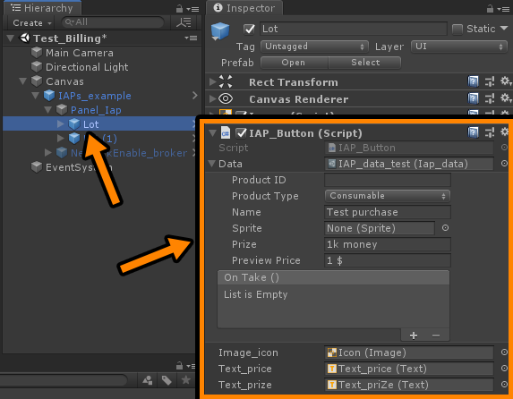
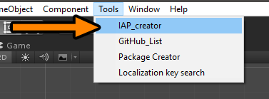
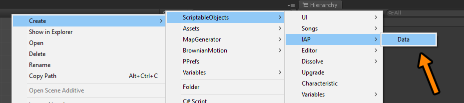
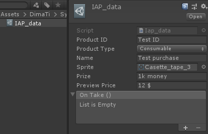

# IAP unity based
[](https://unity3d.com/get-unity/download)

<!-- TABLE OF CONTENTS -->
<details open="open">
  <summary>Table of Contents</summary>
  <ol>
    <li><a href="#How-to-add-IAP-to-project">How to add IAP to project</a></li>
    <li><a href="#How-to-create-and-configure-IAP_Data-files">How to create and configure IAP_Data files</a></li>
    <li><a href="#How-IAP-package-work">How IAP package work</a></li> 
  </ol>
</details>

# !!! WARNING !!! 
Folder in Plugins/UnityChannels  Must be Deleted if exist! Otherwise Google Play will Ban your application with message `AliPay wanna permission to phone number`

## How to add IAP to project
* PackageManager.`UnityIAP` Update to version `2.2.2`
* Enable `UnityAnalytics` and `UnityIAP`
* Add GooglePlay public key to UnityIAP
* Create UnityIAP Tangles => Obfuscate GooglePublicKey
* Create file `IAPTangles.asmdef` in folder with generated Tangles (Assets/Plugins/UnityPurchasing/Generated/)
* Download package [Google IAP plugin](https://developer.android.com/google/play/billing/unity#import-plugin) => google-play-plugins-1.6.0.unitypackage
* Import this package to project
* If needed Enable #define RECEIPT_VALIDATION 
* Drop to scene prefabButton from Samples~ or create your own prefab with script `IAP_Button.cs`

* Assign IAP_Data file to button


## How to create and configure IAP_Data files
* Create IAP_Data file. Has 2 ways:
  - First is `BETTER` <br /> 
  - Second <br /> 
  
  ```json
  Keep in mind
    - All IAP_Data files must be plase in `Resources/IAP/Data/`
    - IAP_manager must be plase in `Resources/IAP/`
  ```
  
Configure IAP_Data file <br />


## How IAP package work

* When `IAP_Buttton` OnEnable => static `IAP_InitializeBroker.TryOnCheck()`;
* static `IAP_InitializeBroker` Check internet connection.
  - If need, in this stage you can block interface by NoInternetConnection
* Only if online static `IAP_InitializeBroker` initilize `IAP_manager`
* When user click to `IAP_Button` =>  IAP_InitializeBroker.TryOnCheck(callback `with action for buy if internetON`);
* if `networkOn`, static IAP_InitializeBroker `invoke callback` (where IAP_data object waiting)
* `IAP_data` object invoke `IAP_manager` for `buy` item
* if `IAP_manager` complete transaction, then invoke `IAP_data` for `reward`

----
* All `rewards` must be configured in `IAP_data` file in `UnityEvent`
* No Internet Message handled by other package
* No Internet callback handled by other package
