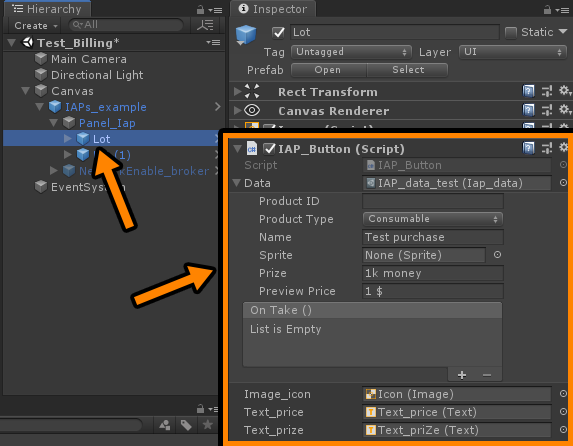
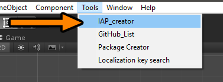
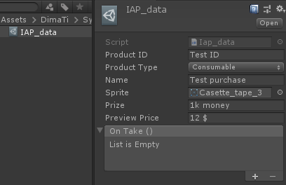

# IAP unity based


## How to add IAP to project:
* Drop to scene prefabButton from Samples~ or create your own prefab with script `IAP_Button.cs`

* Assign IAP_Data file to button

## How to create and configure IAP_Data files:
* Create IAP_Data file. Has 2 ways:
  - First is `BETTER` <br /> 
  - Second <br /> 
  
  ```json
  Keep in mind
    - All IAP_Data files must be plase in `Resources/IAP/Data/`
    - IAP_manager must be plase in `Resources/IAP/`
  ```
  
Configure IAP_Data file <br />


## How IAP package work:

* When `IAP_Buttton` OnEnable => static `IAP_InitializeBroker.TryOnCheck()`;
* static `IAP_InitializeBroker` Check internet connection.
  - If need, in this stage you can block interface by NoInternetConnection
* Only if online static `IAP_InitializeBroker` initilize `IAP_manager`
* When user click to `IAP_Button` =>  IAP_InitializeBroker.TryOnCheck(callback `with action for buy if internetON`);
* if `networkOn`, static IAP_InitializeBroker `invoke callback` (where IAP_data object waiting)
* `IAP_data` object invoke `IAP_manager` for `buy` item
* if `IAP_manager` complete transaction, then invoke `IAP_data` for `reward`

----
* All `rewards` must be configured in `IAP_data` file in `UnityEvent`
* No Internet Message handled by other package
* No Internet callback handled by other package
